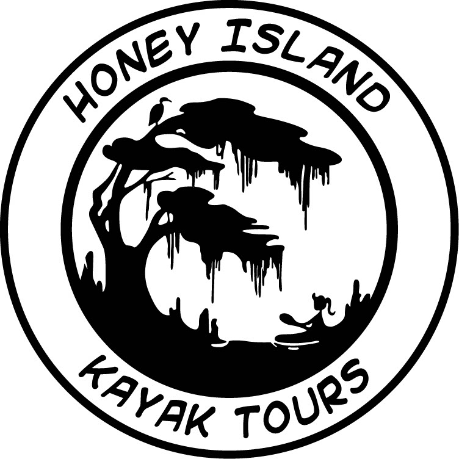
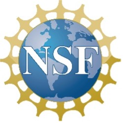
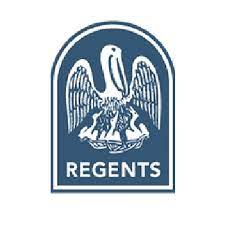
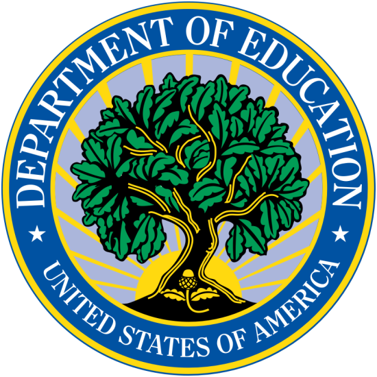

 
We are currently seeking funds to support BRCC students and local high school students
with internships along their journey of exploring the world of freshwater sponges. Funds will be used to support students through research stipends, student travel to sites for collections and presentations at conferences, and consumables needed for the project. Every penny donated will go to support students working on this project!
 
 

<iframe width="560" height="315" src="https://www.youtube.com/embed/bYqfW42UKWA" title="YouTube video player" frameborder="0" allow="accelerometer; autoplay; clipboard-write; encrypted-media; gyroscope; picture-in-picture" allowfullscreen></iframe>

 
 
All donations are accepted through the BRCC foundation. Please contact Dr. Miller at millerm2@mybrcc.edu if you have questions about donations, you are welcome to call her at 225-216-8528.

Thank you to our current personal supporters:
 
Michelle Watkins
 
Sondra LeBreton
 
 
 
Thank you to our current corporation sponsors:
 
{width=25%}
 
[Honey Island Kayak Tours](https://www.honeyislandkayaktours.com/)
 
 

**Supporting Grants:**
 
 
_Current_
 
 
{width=25%}
 
NSF Funding Opportunity PD 21-7980. The Louisiana Freshwater Sponge Project: Developing an Environmental Science Undergraduate Research Pathway from Degree Entry to Workforce and Graduation Award # 2329630 (10/2023 - 9/2028)
 
 

{width=25%}
 
BoRSF Department Enhancement Grant # ENH-DE-01 (07/2023 - 06/2024)
 
 
_Previous_
 
 
{width=25%}
 
Capital One STEM for Good Grant
 
 
{width=25%}
 
MSEIP Department of Education Grant # P120A180060
 
 

