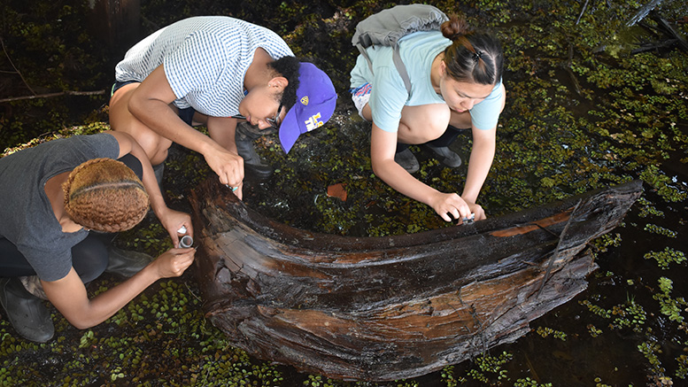
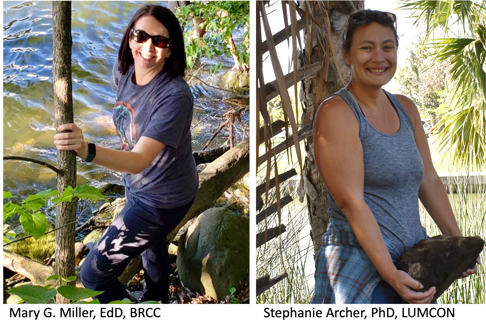

<h2>Home of the Louisiana Freshwater Sponge Hunters</h2>

 
 

<iframe width="560" height="315" src="https://www.youtube.com/embed/Pa7KmO6KDtg" title="YouTube video player" frameborder="0" allow="accelerometer; autoplay; clipboard-write; encrypted-media; gyroscope; picture-in-picture" allowfullscreen></iframe>

 
  
Welcome to the Louisiana Freshwater Sponge Hunters page! 
 
 
This is a longitudinal study; data on this page are updated continuously so check back often!
 
 
The Louisiana Freshwater Sponge Project was started by Dr. Mary Miller and a group
of interns through Baton Rouge Community College, in the Summer of 2019. The project was a follow up from the original survey that was conducted by [Dr. Michael Poirrier in 1969](https://core.ac.uk/download/pdf/217384297.pdf). 
 
 
**Aims of the Project:**
 
 
1. Bring awareness of freshwater sponges to the general public through outreach activities. 
 
2. Provide research experiences to first and second year college students through [The Environmental Science Research Pathway at Baton Rouge Community College.](the_environmental_research_pathway.html)
 
3. Continuously monitor the freshwater sponge population in Louisiana as environmental health indicators and to share those finding in scientific journals and conference presentations.
 
 

 
 
The project is now shared between two institutions:
 
 
[Baton Rouge Community College](https://www.mybrcc.edu/), still led by Dr. Miller, and 
[Louisiana Universities Marine Consortium](https://www.lumcon.edu/), led by Dr. Stephanie Archer. The two have continued to collaborate with Dr. Poirrier to identify sponges and answer questions related to these environmental health indicators.
 
 

{width=75%}

 

For direct information, please contact Dr. Mary Miller at:
 
brccresearch@gmail.com
 
or at
 
millerm2@mybrcc.edu
 
 
Follow along with us on our adventures:
 
[Instagram @laspongehunters](https://instagram.com/laspongehunters/ "Instagram")
 
[Twitter @laspongehunters](https://twitter.com/laspongehunters "Twitter")

 
 
 
 
 
 
Scientific collection of sponges for this project is governed through the issued Louisiana Wildlife and Fisheries scientific collecting Permit #SCP202.
 
 
