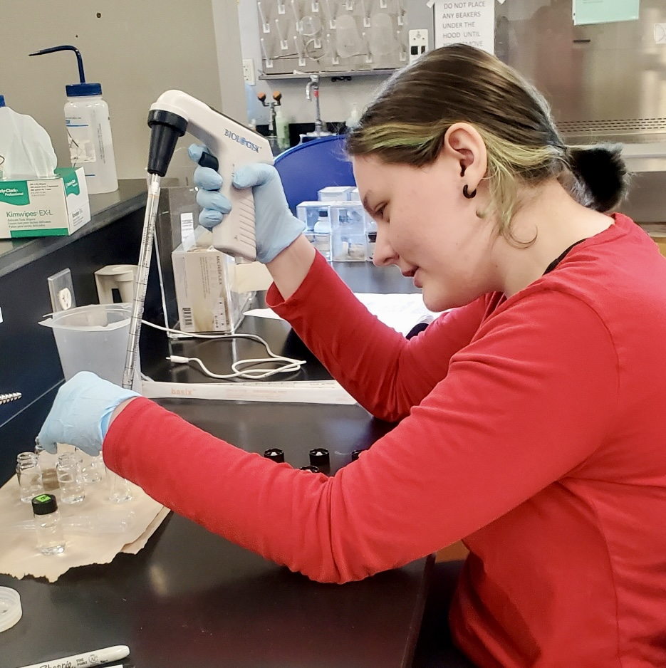
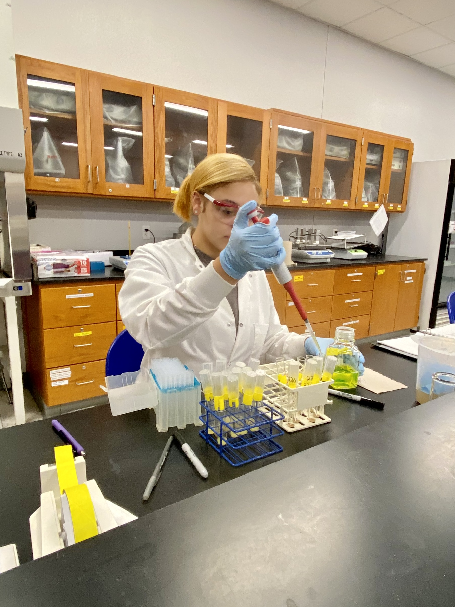

 
The Louisiana Freshwater Sponge Research Team consists of biology, computer science, and pre-engineering BRCC students. All have individual roles in the projects that come together to create an ongoing database that allows us to understand the health of freshwater sponges in Louisiana!
 
 

{width=50%}

 Pictured above (from left to right): Hayley Howard, Dr. Stephanie Archer (LUMCON), Abhi Mehrotra, and Tarry Glover. 

 
 

**Undergraduate Research Mentors:**
 
 
{width=25%}
 
Lisa DiMaggio
 
Spring 2022 -
 
"I am currently a general science major. My future plans include a bachelor's degree in laboratory science and my career aspiration is to work in forensics. My role in the Louisiana Freshwater Sponge Project is spicule identification and sediment analysis."

 
 
{width=25%}
 
Tarry Glover
 
Summer 2020 -
 
"My name is Tarry Glover. I joined the Freshwater Sponge Project in 2020. I am responsible for molecular work which includes DNA isolation and PCR amplification. I also work with MEGA-X software and the NCBI database After I graduate, I plan on transferring to FranU and completing the medical laboratory science program."

 
 
{width=25%}
 
Hayley Howard
 
Summer 2022 - 
 
"I am currently majoring in natural resource ecology and management and my role in the Louisiana Freshwater Sponge Project is water analysis. After completing my Associates of Science Transfer degree, I hope to attend LSU to continue my education in wildlife ecology. A fun fact about me is that I have been a vegetarian for about 14 years now."

 
 
{width=25%}
 
Abhi Mehrotra
 
Summer 2021 -
 
"I feel incredibly fortunate to be a part of The Louisiana Freshwater Sponge Project as the first computer science major. In this role, I am responsible for a variety of tasks including managing the project's website, operating drones, analyzing and managing data, and conducting fieldwork. Additionally, I assist with overseeing other aspects of the research project. My long-term objective is to obtain an Associate of Science (AS) degree in Computer Science and a Louisiana Transfer, Associate of Science (ASLT) degree with a focus on biological sciences from BRCC. Afterward, I plan to pursue a Bachelor of Science (BS) degree in Coastal Environmental Science with a specialization in data science and a minor in biological sciences at Louisiana State University."
 
 

**Undergraduate Student Researchers:**
 
 
{width=25%}
 
Rose Dawes
 
Fall 2023 -
 
"Hi! My name is Rose Dawes and I’m a computer science major here at BRCC. My role in the lab is to conduct data analysis using R Studio. I also assist with fieldwork. In the future, I plan on pursuing my bachelor’s degree in data science and/or environmental science."

 
 
{width=25%}
 
Sydney Gemeinhardt
 
Summer 2023 -
 
"My name is Sydney Gemeinhardt and I am currently majoring in biological sciences. My role in the lab is to digest and prepare sponges for spicule identification and test water quality. Once I finish my two years at BRCC, I plan to transfer to LSU to get my Bachelor of Science in Biological Sciences. My career aspirations are to work in a forensics lab as a criminalist."

 
 
{width=25%}
 
Destiny Marvel
 
Summer 2023 - 
 
"My name is Destiny Marvel. I am currently majoring in biological sciences. My role in the Louisiana Freshwater Sponge Project is sediment analysis, microscopy, and inputting data using the Mega-X software. Upon completion of my Associate of Science in Biological Sciences degree, I hope to pursue a career working as a lab technician in a chemical plant."

 
 
{width=25%}
 
Tamieka Palmer
 
Summer 2023 -
 
"My name is Tamieka Palmer, and I am a science major with a concentration in biological science. My position for the Freshwater Sponge Project is DNA Isolation and PCR amplification. I would like to further my education to become a chemical engineer or a biochemist. A fun fact about me is that I enjoy jazz music and New Orleans candlelight concerts, but I have never been to one in person."
 
 

**Administrative Assistant:**
 
 
{width=25%}
 
Camille Kolniak
 
Spring 2024 -
 
"Hello! My name is Camille Kolniak and I'm at BRCC studying Nursing and General Science. My role in the lab consists of administrative duties and lab assisting. I love to spend time with family, as well as my pet bird who can talk. My career goals in life are to work in operating rooms as a surgical nurse and go back to school to get my bachelor's degree in Nursing. At some point during my career, I plan to study Anesthesiology to expand my knowledge."
 
 

**The Program for Successful Employment (PSE) Interns:** The Program for Successful Employment (PSE) is a two-year vocational training program for adults with autism and/or other cognitive differences. The program combines academic and job skills training with externship opportunities in regional businesses. [Click here](https://www.mybrcc.edu/pse/index.php) to learn more information about the program.
 
 
Currently recruiting for Summer 2024.
 
 

**Previous Research Mentors:** these students trained students on molecular techniques, sponge collection, and sponge dissection. These students are always available for outreach opportunities and are 100% dedicated to the Freshwater Sponge Survey, even after they graduate.
 
 
Cooke, Kenzie M.: Summer 2021 - Summer 2022
 
Heyer, Matthew: Fall 2019 - Summer 2021
 
Viator, Ariel D.: Spring 2020 - Spring 2022
 
Vuong, Chau: Summer 2019 - Spring 2021
 
 

**Previous Undergraduate Student Researchers:**
 
 
Ardoin, Elyzabeth: Spring 2023
 
Arroyo, Elsa: Summer 2020 - Summer 2021
 
Bieller, Amori: Spring 2022 - Spring 2023
 
Boone, Cristina: Summer 2020 - Spring 2021
 
Ciarlini, Duda: Fall 2021
 
Francois, Jaylon: Fall 2022
 
Henriquez, Axel: Spring 2022 - Summer 2022
 
Johnson, Samuel J.: Fall 2021 - Spring 2022
 
Latore, Jada: Spring 2023
 
Lee, Britney: Fall 2021 - Spring 2022
 
Motsenbocker, Cameron: Summer 2023 - Fall 2023
 
Skelton, Raven: Fall 2021 - Spring 2022
 
Smith, Charmaine: Summer 2019 - Spring 2020
 
White, Kendall: Spring 2022 - Fall 2022
 
Worley, Raven: Fall 2021 - Spring 2022
 
 

**Previous High School Student Researchers:** these students participated in research at BRCC while completing their high school degree.
 
 
Collins, Makayla (Helix Mentorship STEAM Academy): Fall 2021 - Summer 2022
 
 

**Previous Summer Research Interns:** these students dedicated their summer to studying sponges and contributing to the Louisiana database.
 
 
Summer 2020:
 
Harris, Jonathan
 
Moore, Quinton
 
 
Summer 2019:
 
Curvin, Diamonique
 
Moore, Quinton
 
Santos, Daisy
 
Vanichchagorn-Howell, Cole
 
 

**Previous Program for Successful Employment (PSE) Interns:**
 
 
Fuselier,Lauren: Summer 2023 - Fall 2023 
 
Britten, Dylan: Summer 2023
 
 

**Curriculum Developers:** these students were involved in developing the CURE curriculum for the implementation of the Freshwater Sponge Survey in the second Biology Lab at BRCC.
 
 
Hanna, Lauren: Summer 2021
 
Hogan, Michael: Summer 2019
 
Lee, Rebecca: Summer 2020
 
Roussel, Ori: Summer 2019
