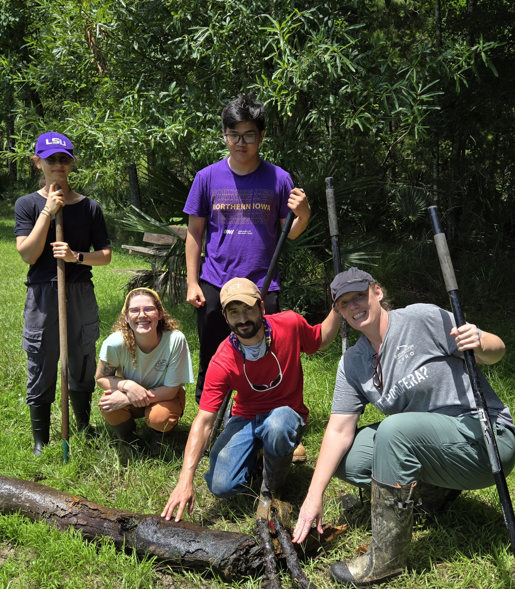
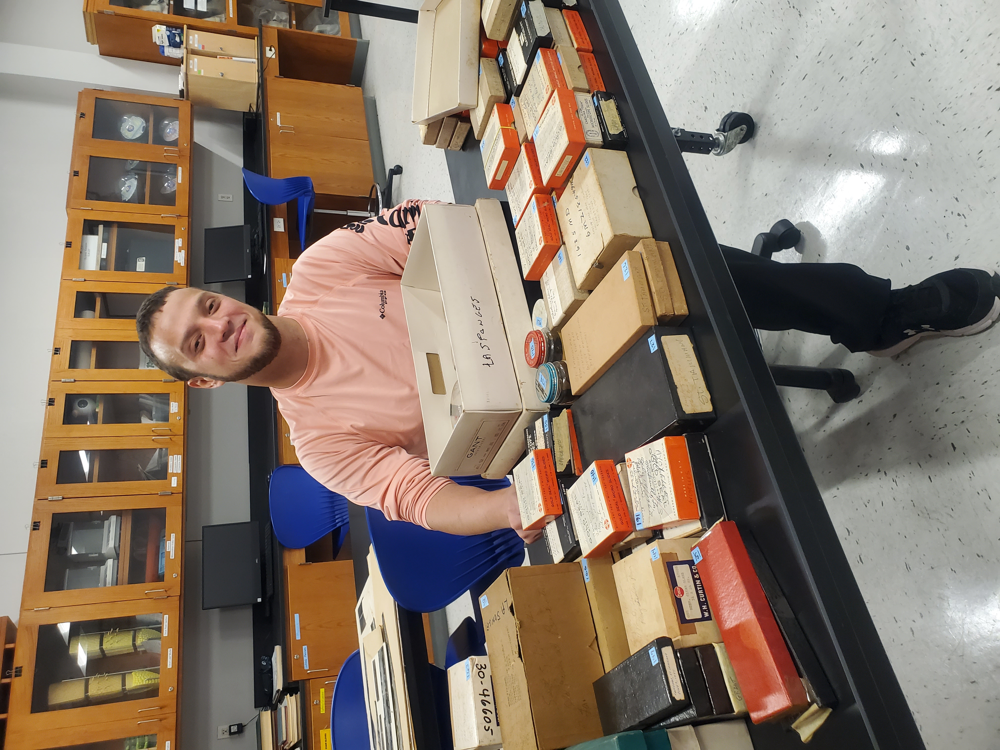

 
The Louisiana Freshwater Sponge Research Team consists of biology, computer science, and pre-engineering BRCC students. All have individual roles in the projects that come together to create an ongoing database that allows us to understand the health of freshwater sponges in Louisiana!
 
 

{width=50%}

 Pictured above (from left to right): Selin Oral, Sarah Darst, Michael Reulet, Loc Nguyen, and Lisa DiMaggio. 

 
 

**Undergraduate Research Mentors:**
 
 
{width=25%}
 
Juliana Coletti
 
Molecular, Summer 2024 -
 
 
"Hello! My name is Juliana, and I'm currently majoring in Biological Sciences. Once I complete the Associate of Science Transfer degree at BRCC, I plan to transfer to LSU for a Bachelor of Science in Natural Resource Ecology and Management. My goal is to pursue a career in habitat restoration and wildlife ecology. I then plan to obtain a Master of Science in Renewable Natural Resources from LSU to help improve and protect ecosystems and their biodiversity. A fun fact about me is that I love Korean skincare."

 
 
{width=25%}
 
Sarah Darst
 
Water Quality, Summer 2024 -
 
 
"I am Sarah Darst, a biology major at Baton Rouge Community College (BRCC). After completing my studies at BRCC, I plan to transfer to Louisiana State University's College of the Coast and Environment. There, I'll pursue the 3+3 track for environmental law, aiming to obtain a Bachelor of Science in Coastal Environmental Science and subsequently, a law degree. Outside of academics, I'm a pet enthusiast with three cats and a dog who make excellent study companions."

 
{width=25%}
 
Kit Hill
 
Data Science, Summer 2024 -
 
 
"I’m majoring in both Computer Science and Biological Sciences at BRCC. After completing my associate degrees at BRCC, I’ll transfer to LSU’s College of the Coast and study both coastal environmental science and computer science. In the future, I’d love a career in computational biology utilizing bioinformatics. A fun fact about me: I’ve been vegan since 2017!"
 
 
{width=25%}
 
Jesse Mehaffey
 
Sediment Microscopy, Spring 2025 -
 
 
"Hello! My name is Jesse Mehaffey and I am a Pre-Engineering student who is focusing on
Biological Engineering. After I finish the Pre-Engineering program I want to transfer to LSU
and double major in Biological Engineering and Applied Coastal and Environmental
Science to reach my goal of being a Coastal and Environmental Engineer so I can help save
the Earth in any way I can, engineering the path to a healthy future for people and for the
Earth. Fun fact about me, I hold an immense amount of completely random knowledge in
my head, so if you spend time with me, you’re bound to learn something new!"

 
 
{width=25%}
 
Geremiah Perkins
 
Field Expert and Sediment Microscopy, Summer 2024 -
 
 
"My name is Geremiah Perkins, and I am majoring in Pre-Engineering with a concentration in Environmental Engineering. My role in the lab is sediment microscopy and assisting in sponge expeditions. I plan to transfer to LSU to further my education and hopefully obtain a job in water purification. A fun fact about me is that my favorite video game is Persona 4."
 
 
{width=25%}
 
Mallory Rhymer
 
Field Expert and Water Quailty, Spring 2025 -
 
 
"My name is Mallory Rhymer. I am currently studying Biological Science at Baton Rouge Community College with plans to transfer to a four-year university. I am passionate about studying ecosystems and the ways humans interact with nature. After completing my degree, I hope to work in ecology or outdoor education, combining scientific research with hands-on fieldwork. A fun fact about me is that I used to work as an outdoor educator in the Shenandoah valley."
 
 
{width=25%}
 
Nicholas Teegarden
 
Field Expert and Data Science, Summer 2024 -
 
 
"My name is Nicholas Teegarden, and I am grateful for the opportunity to work with The Louisiana Freshwater Sponge Project. My role in the lab is preparing spicule samples for identification. I am currently majoring in General Science at BRCC and will be transferring to LSU's College of the Coast, majoring in Natural Resource Ecology and Management. Upon graduation, I hope to work in an ecology lab, contributing to the protection and conservation of Louisiana's beautiful ecosystems."
 
 
**Undergraduate Student Researchers:**
 
 
{width=25%}
 
Abigail Curl
 
Scanning Electron Microscopy, Summer 2025 -
 
 
"I am currently pursuing an associate’s degree in Computer Science. After completing my degree, I plan to transfer to Louisiana State University to earn a bachelor’s degree in Computer Science."
 
 
{width=25%}
 
Alejandro Jose
 
Nanoplastic studies, Summer 2025 -
 
 
"In the future, I plan to transfer to Tulane or Cornell after obtaining my associate's degree. I plan to complete my undergraduate degree in Biochemistry or Biomedical Engineering. In the near future, I plan to open my own dermatology clinics in my hometown and Mexico City. During my free time, I enjoy reading books, playing tennis, and traveling the world."
 
 
{width=25%}
 
Oscar Mendoza
 
Sediment Processing and molecular, Summer 2025 -
 
 
"I am working on an associate's degree in science at BBRC. After I get my associates, I plan to transfer to LSU and pursue a bachelor's in biological engineering. My dream job after I get my bachelor's would be to work with CRISPR and use it to develop new therapies for genetic diseases, cancers, and infectious diseases."
 
 
{width=25%}
 
Loc Nguyen
 
Data Science, Summer 2025 -
 
 
"I'm currently a sophomore at Baton Rouge Community College. I'm excited about my academic journey, as I'm planning to transfer to Louisiana State University to pursue a degree in Data Science, with a particular focus on Artificial Intelligence and Machine Learning. I love camping and hiking, and spending time immersed in nature has truly made me appreciate its beauty and tranquility. It's a fantastic way to clear my head and recharge, and I find a lot of peace in the quiet of the wilderness."
 
 
{width=25%}
 
Selin Oral
 
Molecular, Summer 2025 -
 
 
"My current major at BRCC is biological sciences. After I complete my credits here, I plan to transfer to LSU to get my Bachelor degree in veterinary medicine. Fun fact about me: I was a professional finswimmer for 15 years and won 2nd and 3rd place medals in my home country, so I am interested in healthy eating and cooking. Although I am no longer a finswimmer, I still enjoy doing physical activities, especially yoga."
 
 
{width=25%}
 
Michael Reulet
 
Field expert and sponge ID microscopy, summer 2025 -
 
 
"I am currently pursuing a degree in General Science Transfer with coursework in Plant and soil Science focusing on Agriculture at Louisiana State University. The NSF sponsored program at Baton Rouge Community College under Dr. Miller has provided a wonderful opportunity for practical application of concepts learned during my course of study as well as participation in formal scientific research. I am also a member of the Conservation Corps BREC."
 
 
{width=25%}
 
Brittany Tate
 
Data Science, Summer 2025 -
 
 
"I am a Computer Science major at BRCC. My role in the Louisiana Freshwater Sponge Project is data science and analytics.  After receiving my Associate of Science degree, I plan to attend LSU's College of Engineering and Computer Science, to obtain my Bachelor's of Science in Computer Science with a concentration in Data Science and Analytics. Afterwards, I plan to attend a JD/PhD program, to align data science and law through interdisciplinary research."
 
 
{width=25%}
 
Tran Vi
 
Scanning Electron Microscopy and Water Quality, Summer 2025 -
 
 
"I am currently majoring in Physical Sciences at BRCC. I am a member of the Louisiana Sea Grant Program, where I research the impact of heavy metals on water systems and their contribution to the malformation of freshwater sponges. After completing the Associate’s degree, I plan to transfer to LSU to earn a Bachelor’s degree in a STEM field. In the future, I hope to gain hands-on experience through both laboratory and field work as I want to pursue a career in science."
 
 
**The Program for Successful Employment (PSE) Interns:** The Program for Successful Employment (PSE) is a two-year vocational training program for adults with autism and/or other cognitive differences. The program combines academic and job skills training with externship opportunities in regional businesses. [Click here](https://www.mybrcc.edu/pse/index.php) to learn more information about the program.
 
 

**Previous Research Mentors:** these students trained students on molecular techniques, sponge collection, and sponge dissection. These students are always available for outreach opportunities and are 100% dedicated to the Freshwater Sponge Survey, even after they graduate.
 
 
Cooke, Kenzie M.: Summer 2021 - Summer 2022
 
Dawes, Rose: Fall 2023 - Fall 2024
 
DiMaggio, Lisa: Spring 2022-Summer 2025
 
Gemeinhardt, Sydney: Summer 2023 - Spring 2025
 
Glover, Tarry: Summer 2020 - Summer 2024
 
Gremillion, Julia: Summer 2024 - Summer 2025
 
Heyer, Matthew: Fall 2019 - Summer 2021
 
Howard, Hayley: Summer 2022 - Summer 2025
 
Marvel, Destiny: Summer 2023 - Spring 2025
 
Mcquirter, Marquis: Summer 2024 - Summer 2025
 
Mehrotra, Abhi: Summer 2021 - Fall 2024
 
Viator, Ariel D.: Spring 2020 - Spring 2022
 
Vuong, Chau: Summer 2019 - Spring 2021
 
 

**Previous Undergraduate Student Researchers:**
 
 
Ardoin, Elyzabeth: Spring 2023
 
Arroyo, Elsa: Summer 2020 - Summer 2021
 
Bieller, Amori: Spring 2022 - Spring 2023
 
Boone, Cristina: Summer 2020 - Spring 2021
 
Ciarlini, Duda: Fall 2021
 
Francois, Jaylon: Fall 2022
 
Henriquez, Axel: Spring 2022 - Summer 2022
 
Hill, Candace: Spring 2025
 
Johnson, Samuel J.: Fall 2021 - Spring 2022
 
Latore, Jada: Spring 2023
 
Lee, Britney: Fall 2021 - Spring 2022
 
Motsenbocker, Cameron: Summer 2023 - Fall 2023
 
Palmer, Tamieka: Summer 2023 - Summer 2024
 
Skelton, Raven: Fall 2021 - Spring 2022
 
Smith, Charmaine: Summer 2019 - Spring 2020
 
White, Kendall: Spring 2022 - Fall 2022
 
Worley, Raven: Fall 2021 - Spring 2022
 
 

**Previous High School Student Researchers:** these students participated in research at BRCC while completing their high school degree.
 
 
Collins, Makayla (Helix Mentorship STEAM Academy): Fall 2021 - Summer 2022
 
 
Calmes, Mason (Denham Springs High School): Summer 2024
 
Poydras, Morgan (Glen Oaks Magnet High School): Summer 2024
 
 

**Previous Summer Research Interns:** these students dedicated their summer to studying sponges and contributing to the Louisiana database.
 
 
Summer 2020:
 
Harris, Jonathan
 
Moore, Quinton
 
 
Summer 2019:
 
Curvin, Diamonique
 
Moore, Quinton
 
Santos, Daisy
 
Vanichchagorn-Howell, Cole
 
 

**Previous Program for Successful Employment (PSE) Interns:**
 
 
Fuselier,Lauren: Summer 2023 - Fall 2023 
 
Britten, Dylan: Summer 2023
 
 

**Previous Administrative Assistant:**
 
 
Kolniak, Camille: Spring 2024
 
 

**Curriculum Developers:** these students were involved in developing the CURE curriculum for the implementation of the Freshwater Sponge Survey in the second Biology Lab at BRCC.
 
 
Hanna, Lauren: Summer 2021
 
Hogan, Michael: Summer 2019
 
Lee, Rebecca: Summer 2020
 
Roussel, Ori: Summer 2019
