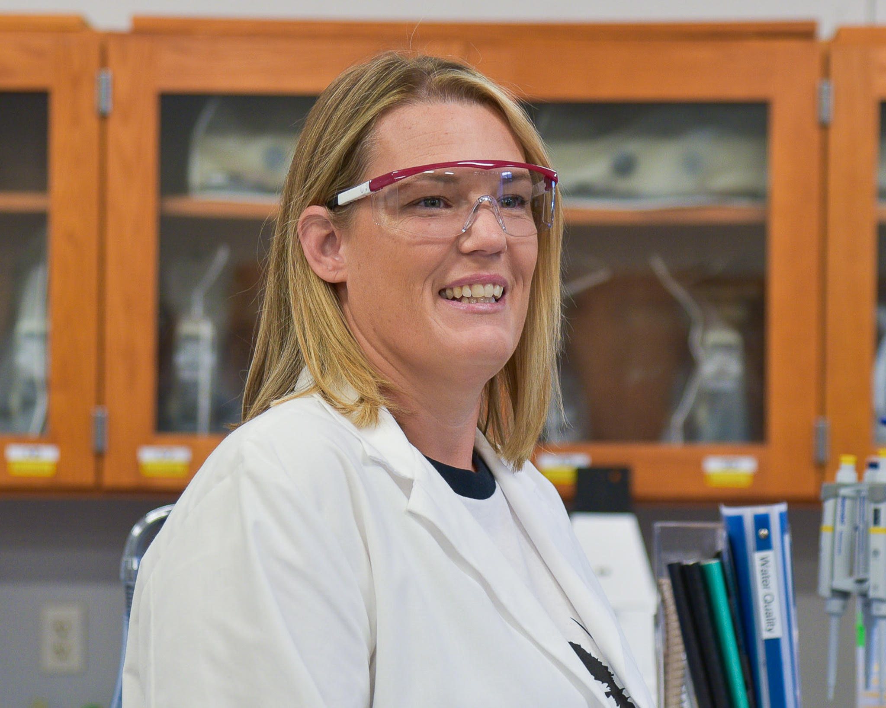
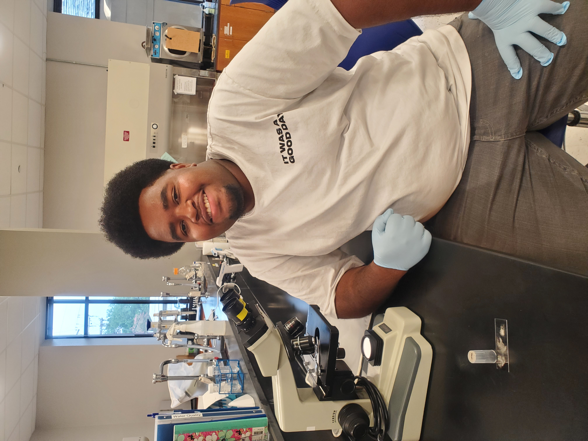

 
The Louisiana Freshwater Sponge Research Team consists of biology, computer science, and pre-engineering BRCC students. All have individual roles in the projects that come together to create an ongoing database that allows us to understand the health of freshwater sponges in Louisiana!
 
 

{width=50%}

 Pictured above (from left to right): Hayley Howard, Dr. Stephanie Archer (LUMCON), Abhi Mehrotra, and Tarry Glover. 

 
 

**Undergraduate Research Mentors:**
 
{width=25%}
 
Lisa DiMaggio
 
Spring 2022 -
 
"My name is Lisa DiMaggio, and I've been a part of the lab since January 2022. I graduated with an Associate degree in Biological Science in May 2023 and transferred into the Nursing program. After receiving my ASN, my plan is to work on my BSN while pursuing a career in research nursing. A fun fact about me is that I was a hairstylist for nearly 20 years."

 
 
{width=25%}
 
Hayley Howard
 
Summer 2022 - 
 
"I am currently majoring in natural resource ecology and management and my role in the Louisiana Freshwater Sponge Project is water analysis. After completing my Associates of Science Transfer degree, I hope to attend LSU to continue my education in wildlife ecology. A fun fact about me is that I have been a vegetarian for about 14 years now."

 
 
{width=25%}
 
Sydney Gemeinhardt
 
Summer 2023 -
 
"My name is Sydney Gemeinhardt and I am currently majoring in biological sciences. My role in the lab is to digest and prepare sponges for spicule identification and test water quality. Once I finish my two years at BRCC, I plan to transfer to LSU to get my Bachelor of Science in Biological Sciences. My career aspirations are to work in a forensics lab as a criminalist."

 
 
{width=25%}
 
Destiny Marvel
 
Summer 2023 - 
 
"My name is Destiny Marvel. I am currently majoring in biological sciences. My role in the Louisiana Freshwater Sponge Project is sediment analysis, microscopy, and inputting data using the Mega-X software. Upon completion of my Associate of Science in Biological Sciences degree, I hope to pursue a career working as a lab technician in a chemical plant."

 
 

**Undergraduate Student Researchers:**
 
 
{width=25%}
 
Juliana Coletti
 
Summer 2024 -
 
"Hello! My name is Juliana, and I'm currently majoring in Biological Sciences. My role in the Freshwater Sponge Project is DNA isolation and PCR amplification, but I also really enjoy fieldwork! Once I complete the Associate of Science Transfer degree at BRCC, I plan to transfer to LSU for a Bachelor of Science in Natural Resource Ecology and Management. My goal is to pursue a career in habitat restoration and wildlife ecology. I then plan to obtain a Master of Science in Renewable Natural Resources from LSU to help improve and protect ecosystems and their biodiversity. A fun fact about me is that I love Korean skincare."

 
 
{width=25%}
 
Sarah Darst
 
Summer 2024 -
 
"I am Sarah Darst, a biology major at Baton Rouge Community College (BRCC). I'm thrilled to join the Louisiana Freshwater Sponge Project as a research intern. My primary role in the project involves testing water parameters, and I'm eager to participate in fieldwork as much as possible. After completing my studies at BRCC, I plan to transfer to Louisiana State University's College of the Coast and Environment. There, I'll pursue the 3+3 track for environmental law, aiming to obtain a Bachelor of Science in Coastal Environmental Science and subsequently, a law degree. Outside of academics, I'm a pet enthusiast with three cats and a dog who make excellent study companions."

 
 
{width=25%}
 
Julia Gremillion
 
Summer 2024 -
 
"My name is Julia Gremillion. I am a Pre-Engineering student with a concentration in Biological Engineering. I am part of a NASA-funded research grant where I will be studying biofilm formation and biodegradation of synthesized polymer-colloidal composites. I plan on transferring to LSU after I complete my Associate's degree. In the future, I hope to pursue a career in research."

 
 
{width=25%}
 
Candace Hill
 
Spring 2025 -
 
"Hi, my name is Candace Hill, and I am a second year at Baton Rouge Community College majoring in biological sciences. This spring semester, I am participating in the Louisiana Sea Grant Program, conducting research on water quality and how heavy metals affect sea sponge formation. I plan on transferring to LSU later this year and majoring in Nutritional Sciences. With my passion for health, research, and athletics, I plan on pursuing a career in the sports medical field."

 
 
{width=25%}
 
Christopher Hill
 
Summer 2024 -
 
"I am currently majoring in both Computer Science and Biological Sciences. In the Louisiana Freshwater Sponge Project, I serve in a data science role. After completing my associate degrees, I plan to transfer to LSU to study Data Science and then pursue a career in either bioinformatics or computational biology. Two fun facts about me: I'm a vegan and a member of Baton Rouge's Golden Guys!"

 
 
{width=25%}
 
Marquis McQuirter
 
Summer 2024 -
 
"I am Marquis McQuirter, and I am majoring in Veterinary Technology. My role in the Louisiana Freshwater Sponge Project is sediment analysis. After completing my Associate of Science Transfer degree, I will go to either Southern University or Northwestern State University to further my education in veterinary technology. In the future, I hope to open my own veterinary clinic."

 
 
{width=25%}
 
Jesse Mehaffey
 
Spring 2025 -
 
"Hello! My name is Jesse Mehaffey and I am a Pre-Engineering student who is focusing on
Biological Engineering. After I finish the Pre-Engineering program I want to transfer to LSU
and double major in Biological Engineering and Applied Coastal and Environmental
Science to reach my goal of being a Coastal and Environmental Engineer so I can help save
the Earth in any way I can, engineering the path to a healthy future for people and for the
Earth. Fun fact about me, I hold an immense amount of completely random knowledge in
my head, so if you spend time with me, you’re bound to learn something new!"

 
 
{width=25%}
 
Geremiah Perkins
 
Summer 2024 -
 
"My name is Geremiah Perkins, and I am majoring in Pre-Engineering with a concentration in Environmental Engineering. My role in the lab is sediment microscopy and assisting in sponge expeditions. I plan to transfer to LSU to further my education and hopefully obtain a job in water purification. A fun fact about me is that my favorite video game is Persona 4."

 
 
{width=25%}
 
Mallory Rhymer
 
Spring 2025 -
 
"My name is Mallory Rhymer. I am currently studying Biological Science at Baton Rouge Community College with plans to transfer to a four-year university. I am passionate about studying ecosystems and the ways humans interact with nature. After completing my degree, I hope to work in ecology or outdoor education, combining scientific research with hands-on fieldwork. A fun fact about me is that I used to work as an outdoor educator in the Shenandoah valley."

 
 
{width=25%}
 
Nicholas Teegarden
 
Summer 2024 -
 
"My name is Nicholas Teegarden, and I am grateful for the opportunity to work with The Louisiana Freshwater Sponge Project. My role in the lab is preparing spicule samples for identification. I am currently majoring in General Science at BRCC and will be transferring to LSU's College of the Coast, majoring in Natural Resource Ecology and Management. Upon graduation, I hope to work in an ecology lab, contributing to the protection and conservation of Louisiana's beautiful ecosystems."
 
 

**The Program for Successful Employment (PSE) Interns:** The Program for Successful Employment (PSE) is a two-year vocational training program for adults with autism and/or other cognitive differences. The program combines academic and job skills training with externship opportunities in regional businesses. [Click here](https://www.mybrcc.edu/pse/index.php) to learn more information about the program.
 
 

**Previous Research Mentors:** these students trained students on molecular techniques, sponge collection, and sponge dissection. These students are always available for outreach opportunities and are 100% dedicated to the Freshwater Sponge Survey, even after they graduate.
 
 
Cooke, Kenzie M.: Summer 2021 - Summer 2022
 
Dawes, Rose: Fall 2023 - Fall 2024
 
Glover, Tarry: Summer 2020 - Summer 2024
 
Heyer, Matthew: Fall 2019 - Summer 2021
 
Mehrotra, Abhi: Summer 2021 - Fall 2024
 
Viator, Ariel D.: Spring 2020 - Spring 2022
 
Vuong, Chau: Summer 2019 - Spring 2021
 
 

**Previous Undergraduate Student Researchers:**
 
 
Ardoin, Elyzabeth: Spring 2023
 
Arroyo, Elsa: Summer 2020 - Summer 2021
 
Bieller, Amori: Spring 2022 - Spring 2023
 
Boone, Cristina: Summer 2020 - Spring 2021
 
Ciarlini, Duda: Fall 2021
 
Francois, Jaylon: Fall 2022
 
Henriquez, Axel: Spring 2022 - Summer 2022
 
Johnson, Samuel J.: Fall 2021 - Spring 2022
 
Latore, Jada: Spring 2023
 
Lee, Britney: Fall 2021 - Spring 2022
 
Motsenbocker, Cameron: Summer 2023 - Fall 2023
 
Palmer, Tamieka: Summer 2023 - Summer 2024
 
Skelton, Raven: Fall 2021 - Spring 2022
 
Smith, Charmaine: Summer 2019 - Spring 2020
 
White, Kendall: Spring 2022 - Fall 2022
 
Worley, Raven: Fall 2021 - Spring 2022
 
 

**Previous High School Student Researchers:** these students participated in research at BRCC while completing their high school degree.
 
 
Collins, Makayla (Helix Mentorship STEAM Academy): Fall 2021 - Summer 2022
 
 
Calmes, Mason (Denham Springs High School): Summer 2024
 
Poydras, Morgan (Glen Oaks Magnet High School): Summer 2024
 
 

**Previous Summer Research Interns:** these students dedicated their summer to studying sponges and contributing to the Louisiana database.
 
 
Summer 2020:
 
Harris, Jonathan
 
Moore, Quinton
 
 
Summer 2019:
 
Curvin, Diamonique
 
Moore, Quinton
 
Santos, Daisy
 
Vanichchagorn-Howell, Cole
 
 

**Previous Program for Successful Employment (PSE) Interns:**
 
 
Fuselier,Lauren: Summer 2023 - Fall 2023 
 
Britten, Dylan: Summer 2023
 
 

**Previous Administrative Assistant:**
 
 
Kolniak, Camille: Spring 2024
 
 

**Curriculum Developers:** these students were involved in developing the CURE curriculum for the implementation of the Freshwater Sponge Survey in the second Biology Lab at BRCC.
 
 
Hanna, Lauren: Summer 2021
 
Hogan, Michael: Summer 2019
 
Lee, Rebecca: Summer 2020
 
Roussel, Ori: Summer 2019
