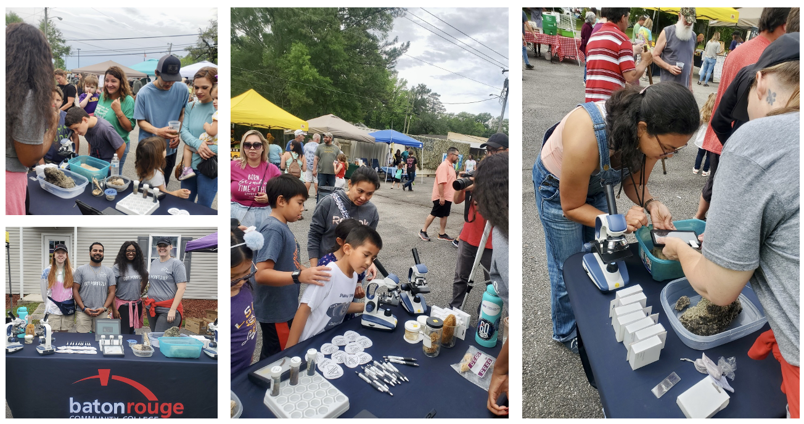
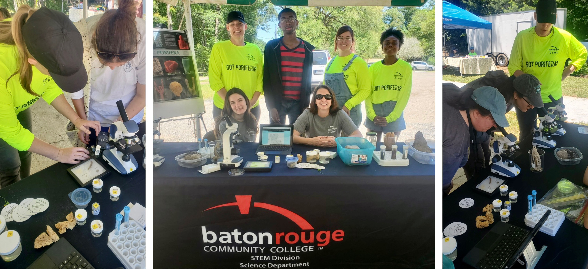
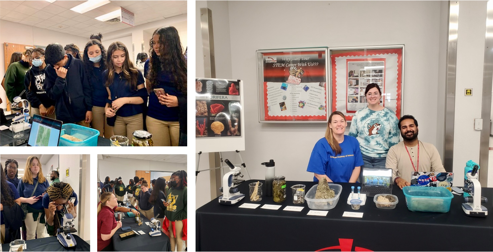
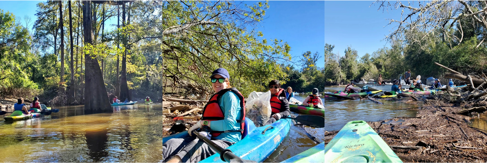

 

**Previous Outreach Events**
 
 
_The Louisiana Freshwater Sponge Lab Tour_
 
 
What is The Louisiana Freshwater Sponge Lab Tour?
 
This event showcased the multiple parts of The Louisiana Freshwater Sponge Project. All lab activities were led by student research mentors which gave them the opportunity to build their scientific communication skills while encouraging high schools students to pursue scientific research as a STEM career.
 
 

_Sweet Tea and Free Trees at the Pearl River & Honey Island Swamp Museum & Research Center_
 
 
What is Sweet Tea and Free Trees at the Pearl River & Honey Island Swamp Museum & Research Center?
 
A Sensory Event which included hands-on exhibits with live animals and much to learn. The Louisiana Freshwater Sponge Project had an interactive booth where participants could view sponges under the microscope and with cellphone clipscopes.
 
 

{width=75%}

 Pictured above: The Louisiana Freshwater Sponge Research Team having an interactive booth at Sweet Tea and Free Trees at the Pearl River & Honey Island Swamp Museum & Research Center to share information about the Freshwater Sponge Project to the public. 

 
 

_BREC BIOBLITZ 2023_
 
 
What is a Bioblitz?
 
A Bioblitz is an intense period of biological surveying in an attempt to record all of the living species within a designated area. Groups of scientists, naturalists and volunteers conduct an intensive field study over a continuous time period, usually 24 hours. BREC Conservation uses the Bioblitz data to focus future field surveys and gather information for our natural resource management plans. It allows BREC to have a better understanding of what is in their parks so they can appropriately manage and protect the land.
 
 

{width=75%}

 Pictured above: The Louisiana Freshwater Sponge Research Team sharing information about the Freshwater Sponge Project to the public at BREC Bioblitz 2023. 

 
 

_BREC BIOBLITZ 2022_
 
 

{width=75%}

 Pictured above: The Louisiana Freshwater Sponge Research Team sharing information about the Freshwater Sponge Project to the public at BREC Bioblitz 2022. 

 
 

_Middle School STEM Day 2023 at BRCC_
 
 
What is Middle School STEM Day?
 
Over 600 eighth grade students from local schools in Louisiana took a tour of BRCC. They learned about degree opportunities available at BRCC and participated in hands-on activities to enrich their STEM experience.
 
 

{width=75%}

 Pictured above: The Louisiana Freshwater Sponge Research Team sharing information about the Freshwater Sponge Project to eighth grade students from local schools in Louisiana at BRCC for Middle School STEM Day 2023. 

 
 

**Previous Volunteering Events**
 
 
_Pearl River Clean Sweep 2022_
 
 
What is the Pearl River Clean Sweep?
 
Cleanup teams will be deployed along the Pearl River Watershed from its Headwaters in Nanih Waiya, Mississippi, downriver through the Ross Barnett Reservoir, along the border of Mississippi and Louisiana, all the way to Pearlington on the Gulf Coast. This event will celebrate drinkable, swimmable, fishable water in 15 counties, 2 parishes, 2 states and over 490 miles of beautiful river! In the past 5 years, this event has engaged more than 3,400 volunteers and removed over 139,000 pounds of trash from the Pearl River watershed!
 
 

{width=75%}

 Pictured above: The Louisiana Freshwater Sponge Research Team participating in the Pearl River Clean Sweep 2022. 

 
 
