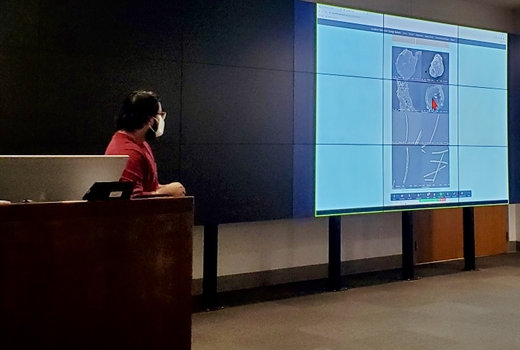
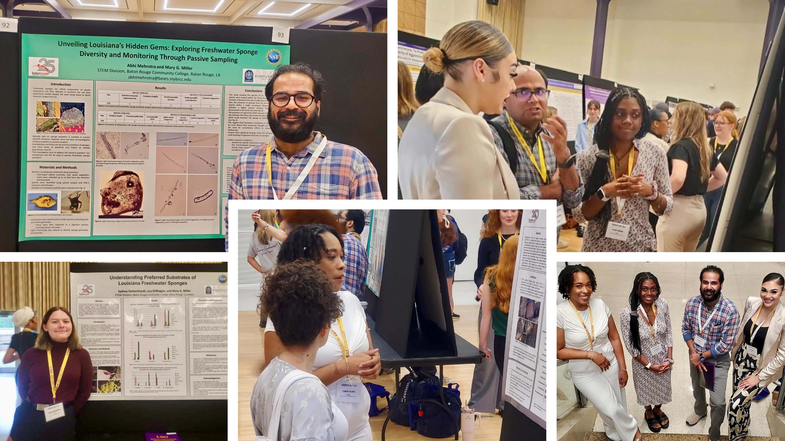
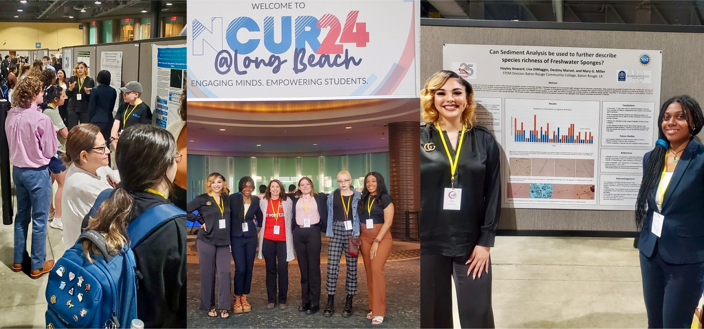
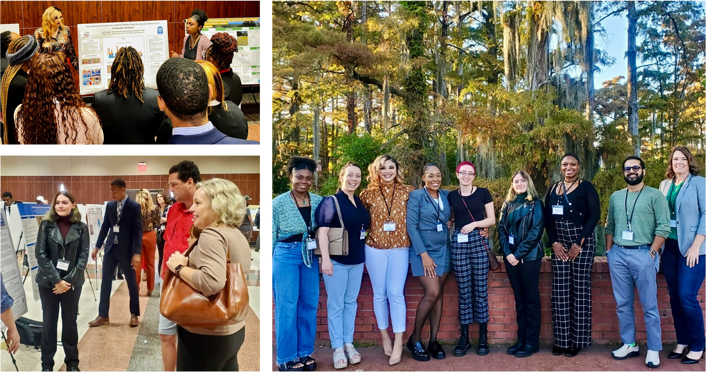
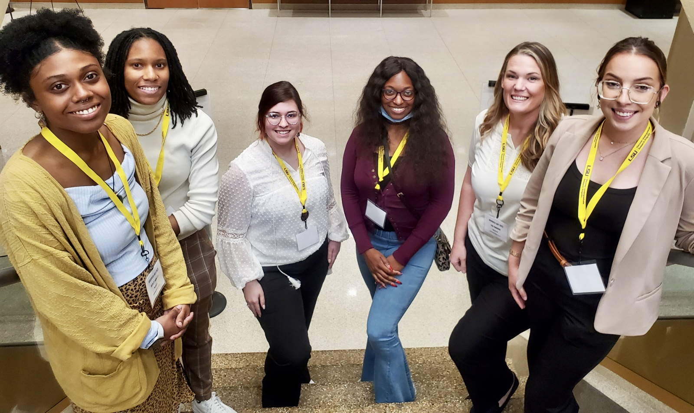
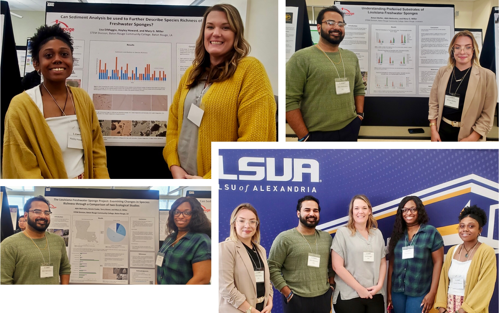
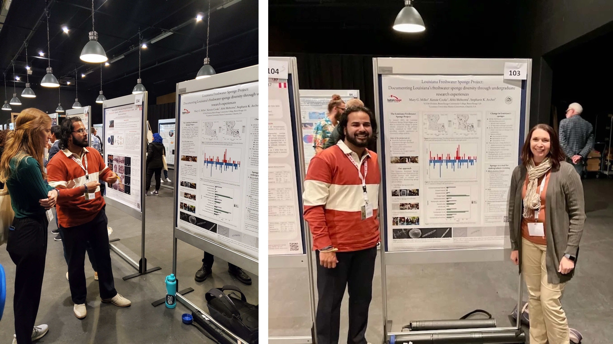
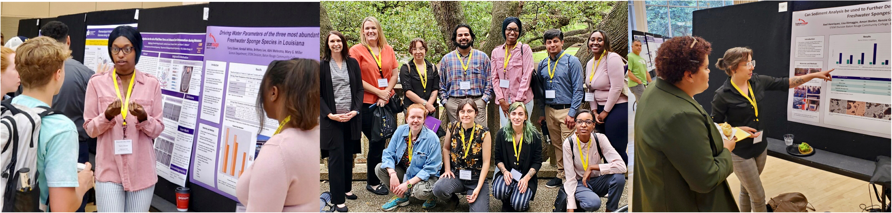
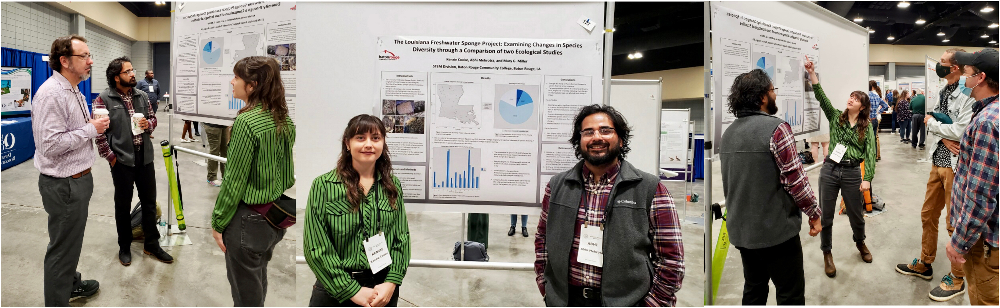

 

{width=75%}

 Pictured above: Mentor Abhi Mehrotra sharing information about the Freshwater Sponge Project to other BRCC students. 

 

**Presentations:** 
 
 

{width=75%}

 Pictured above: The Louisiana Freshwater Sponge Research Team presenting posters at LSU Discover Day Undergraduate Research and Creativity Conference 2024. 

 
 

Howard, Hayley; DiMaggio, Lisa; Marvel, Destiny; and Miller, M.G. _Can Sediment Analysis be used to Further Describe Species Richness of Freshwater Sponges?_, Poster Presentation, Louisiana State University, LSU Discover Day Undergraduate Research and Creativity Conference, 2024.
 
 
Gemeinhardt, Sydney; DiMaggio, Lisa; and Miller, M.G. _Understanding Preferred Substrates of Louisiana Freshwater Sponges_, Poster Presentation, Louisiana State University, LSU Discover Day Undergraduate Research and Creativity Conference, 2024.
 
 
Palmer, Tamieka; Dawes, Rose; Mehrotra, Abhi; Glover, Tarry; and Miller, M.G. _The Louisiana Freshwater Sponge Project: Examining Changes in Species Richness through a Comparison of two Ecological Studies_, Poster Presentation, Louisiana State University, LSU Discover Day Undergraduate Research and Creativity Conference, 2024.
 
 
Mehrotra, Abhi and Miller, M.G. _Unveiling Louisiana’s Hidden Gems: Exploring Freshwater Sponge Diversity and Monitoring Through Passive Sampling_, Poster Presentation, Louisiana State University, LSU Discover Day Undergraduate Research and Creativity Conference, 2024.
 
 

{width=75%}

 Pictured above: The Louisiana Freshwater Sponge Research Team presenting posters at the National Conference on Undergraduate Research (NCUR) 2024 at Long Beach, California. 

 
 

Howard, Hayley; DiMaggio, Lisa; Marvel, Destiny; and Miller, M.G. _Can Sediment Analysis be used to Further Describe Species Richness of Freshwater Sponges?_, Poster Presentation, The Council on Undergraduate Research, National Conference on Undergraduate Research (NCUR), Long Beach, California, 2024.
 
 
Gemeinhardt, Sydney; DiMaggio, Lisa; and Miller, M.G. _Understanding Preferred Substrates of Louisiana Freshwater Sponges_, Poster Presentation, The Council on Undergraduate Research, National Conference on Undergraduate Research (NCUR), Long Beach, California, 2024.
 
 
Palmer, Tamieka; Dawes, Rose; Mehrotra, Abhi; Glover, Tarry; and Miller, M.G. _The Louisiana Freshwater Sponge Project: Examining Changes in Species Richness through a Comparison of two Ecological Studies_, Poster Presentation, The Council on Undergraduate Research, National Conference on Undergraduate Research (NCUR), Long Beach, California, 2024.
 
 
Miller, M.G. _Building the Louisiana Freshwater Sponge Project: The interdisciplinary undergraduate research hub at Baton Rouge Community College_, Mentor-Led Narratives and Storytelling Presentation, The Council on Undergraduate Research, National Conference on Undergraduate Research (NCUR), Long Beach, California, 2024.
 
 
Mehrotra, Abhi; DiMaggio, Lisa; Archer, Stephanie K.; and Miller, M.G. _Documenting Louisiana's freshwater sponge diversity through undergraduate research experiences_, Oral Presentation, The Louisiana Academy of Sciences, 50th Annual Conference Presentation, 2024.
 
 

{width=75%}

 Pictured above: The Louisiana Freshwater Sponge Research Team presenting posters at the Undergraduate Research Conference (URC) 2023 at UL Lafayette. 

 
 

DiMaggio, Lisa; Mehrotra, Abhi; Archer, Stephanie K.; and Miller, M.G. _Documenting Louisiana's freshwater sponge diversity through undergraduate research experiences_, Oral Presentation, University of Louisiana at Lafayette, Undergraduate Research Conference (URC), 2023.
 
 
DiMaggio, Lisa; Howard, Hayley; Marvel, Destiny; and Miller, M.G. _Can Sediment Analysis be used to Further Describe Species Richness of Freshwater Sponges?_, Poster Presentation, University of Louisiana at Lafayette, Undergraduate Research Conference (URC), 2023.
 
 
Glover, Tarry; Palmer, Tamieka; Dawes, Rose; Mehrotra, Abhi; and Miller, M.G. _The Louisiana Freshwater Sponge Project: Examining Changes in Species Richness through a Comparison of two Ecological Studies_, Poster Presentation, University of Louisiana at Lafayette, Undergraduate Research Conference (URC), 2023.
 
 
Gemeinhardt, Sydney; Motsenbocker, Cameron; and Miller, M.G. _Understanding Preferred Substrates of Louisiana Freshwater Sponges_, Poster Presentation, University of Louisiana at Lafayette, Undergraduate Research Conference (URC), 2023.
 
 

{width=75%}

 Pictured above: The Louisiana Freshwater Sponge Research Team presenting posters at LSU Discover Day Undergraduate Research and Creativity Conference 2023. 

 
 

Bieller, Amori; Mehrotra, Abhi; and Miller, M.G. _Understanding Preferred Substrates of Louisiana Freshwater Sponges_, Poster Presentation, Louisiana State University, LSU Discover Day Undergraduate Research and Creativity Conference, 2023.
 
 
DiMaggio, Lisa; Howard, Hayley; Latore, Jada; and Miller, M.G. _Can Sediment Analysis be used to Further Describe Species Richness of Freshwater Sponges?_, Poster Presentation, Louisiana State University, LSU Discover Day Undergraduate Research and Creativity Conference, 2023.
 
 
Mehrotra, Abhi; Ardoin, Elyzabeth; Cooke, Kenzie; Glover, Tarry; and Miller, M.G. _The Louisiana Freshwater Sponge Project: Examining Changes in Species Diversity through a Comparison of two Ecological Studies_, Poster Presentation, Louisiana State University, LSU Discover Day Undergraduate Research and Creativity Conference, 2023.
 
 

{width=75%}

 Pictured above: The Louisiana Freshwater Sponge Research Team presenting posters at the Louisiana Academy of Sciences 49th Annual Conference. 

 
 

Bieller, Amori; Mehrotra, Abhi; and Miller, M.G. _Understanding Preferred Substrates of Louisiana Freshwater Sponges_, Poster Presentation, The Louisiana Academy of Sciences, 49th Annual Conference Presentation, 2023.
 
 
DiMaggio, Lisa; Howard, Hayley; and Miller, M.G. _Can Sediment Analysis be used to Further Describe Species Richness of Freshwater Sponges?_, Poster Presentation, The Louisiana Academy of Sciences, 49th Annual Conference Presentation, 2023.
 
 
Mehrotra, Abhi; Cooke, Kenzie; Glover, Tarry; and Miller, M.G. _The Louisiana Freshwater Sponge Project: Examining Changes in Species Diversity through a Comparison of two Ecological Studies_, Poster Presentation, The Louisiana Academy of Sciences, 49th Annual Conference Presentation, 2023.
 
 

{width=75%}

 Pictured above: Mentor Abhi Mehrotra and PI Dr. Miller presenting a poster at the World Sponge Conference 2022 in Leiden, Netherlands. 

 
 
Miller, M.G; Cooke, Kenzie; Mehrotra, Abhi; and Archer, Stephanie K. _Louisiana Freshwater Sponge Project: Documenting Louisiana’s freshwater sponge diversity through undergraduate research experiences_, Poster Presentation, World Sponge Conference, Leiden, Netherlands, 2022.
 
 

{width=75%}

 Pictured above: The Louisiana Freshwater Sponge Research Team presenting posters at LSU Discover Day Undergraduate Research and Creativity Conference 2022. 

 
 
Glover, Tarry; White, Kendall; Lee, Brittany; Mehrotra, Abhi; and Miller, M.G. _Driving Water Parameters of the three most abundant Freshwater Sponge Species in Louisiana_, Poster Presentation, Louisiana State University, LSU Discover Day Undergraduate Research and Creativity Conference, 2022.
 
 
Henriquez, Axel; DiMaggio, Lisa; Bieller, Amori; Cooke, Kenzie; and Miller, M.G. _Can Sediment Analysis be used to Further Describe Species Diversity of Freshwater Sponges?_, Poster Presentation, Louisiana State University, LSU Discover Day Undergraduate Research and Creativity Conference, 2022.
 
 
Skelton, Raven; Collins, Makayla; Mehrotra, Abhi; and Miller, M.G. _Understanding preferred substrates of Louisiana Freshwater Sponges_, Poster Presentation, Louisiana State University, LSU Discover Day Undergraduate Research and Creativity Conference, 2022.
 
 

{width=75%}

 Pictured above: Mentors Kenzie Cooke and Abhi Mehrotra presenting their poster at the 2022 Annual Conference for the Association of Southeastern Biologists (ASB). 

 
 
Cooke, Kenzie; Mehrotra, Abhi; and Miller, M.G. _The Louisiana Freshwater Sponge Project: Examining Changes in Species Diversity through a Comparison of two Ecological Studies_, Poster Presentation, Association of Southeastern Biologists, Annual Conference Presentation, Little Rock, Arkansa, 2022.
 
 
Miller, M.G. _Building a CURE for Your Monotonous Labs_, Oral Presentation, Louisiana Academy of Sciences, Peer Lecture Presentation, 2021.
 
 
Boone, Cristina. _Inducing Spicule Malformations Within Freshwater Sponges by Relocation_, Poster Presentation, Association of Southeastern Biologists, Annual Conference Presentation, 2021.
 
 
Viator, Ariel and Arroyo, Elsa. _Identifying Freshwater Sponges Along with Creating a New Database_, Poster Presentation, Association of Southeastern Biologists, Annual Conference Presentation, 2021.
 
 
Vuong, Chau and Heyer, Matthew. _Defining Louisiana Freshwater Sponge diversity with COX1-R1 and COX1-D2 Barcoding: A Database Development Study for Classroom Curriculum_, Poster Presentation, Association of Southeastern Biologists, Annual Conference Presentation, 2021.
 
 
Miller, M.G. _The Louisiana Freshwater Sponge Survey Project: Identifying, Characterizing, and Building a Molecular Database_, Oral Presentation, LUMCON Scientific Talks, 2020.
 
 

<iframe width="560" height="315" src="https://www.youtube.com/embed/BKFM70051Ag" title="YouTube video player" frameborder="0" allow="accelerometer; autoplay; clipboard-write; encrypted-media; gyroscope; picture-in-picture" allowfullscreen></iframe>

 
 
Miller, M.G., _Changing the Curriculum to Involve Students in Research Activities_, Oral Presentation, Louisiana Science Teachers Association, Annual Conference Presentation, 2019.
 
 

**Publications:**
 
 
Exciting publications are coming soon!! Please check back.