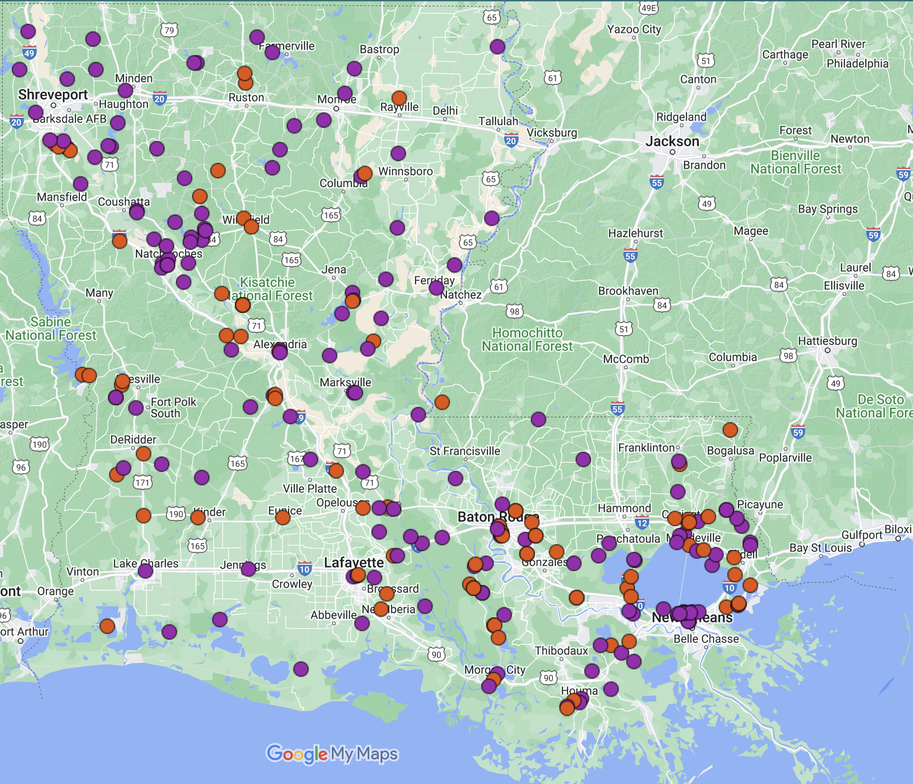
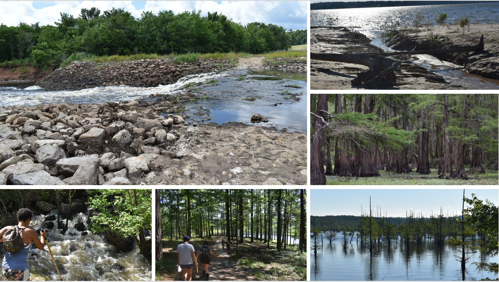

```{=html}
<style type="text/css">
h1.title {
  font-size: 45px;
  text-align: center;
}
body {
background-color: #B9F2FE
}
</style>
```

Currently, we have surveyed over 200 sites! The site map below is continuously updated with the sites surveyed in this study. Sites are further labeled with the observation of sponge presence (purple) or absence (orange).

<br>

<center>
{width=100%}
</center>

<br>
<br>
**History of the Hunt:**
<br>
<br>
In fall 2017, Dr. Miller was invited on a "sponge hunt" with a group of scientists through the [Community College Undergraduate Research Initiative](https://www.ccuri.us/) to collect sponges throughout the New England states. This led to a passion and the idea to implement freshwater sponge research at Baton Rouge Community College.

The Louisiana Freshwater Sponge survey began in the spring 2018 with a group of BRCC students led by Dr. Miller. This began an enthusiastic journey!
<br>
<br>
<center>
<iframe width="560" height="315" src="https://www.youtube.com/embed/VY47zAiFm5U" title="YouTube video player" frameborder="0" allow="accelerometer; autoplay; clipboard-write; encrypted-media; gyroscope; picture-in-picture" allowfullscreen></iframe>
</center>
<br>
<br>
In summer 2019, the "hunt" was in full affect. Dr. Miller led a group of students on a state wide survey. This trip lasted 4 days, and covered 35 parishes! They would spend the summer creating a course curriculum that would be used by BRCC students and for outreach.
<br>
<br>
<center>
{width=75%}
</center>
<br>
<br>
In late May 2021, Dr. Miller and a group of students spent 4 days collecting samples. They spent the remaining summer surveying the southeastern parishes and sharing results in outreach activities!
<br>
<br>
<center>
<iframe width="560" height="315" src="https://www.youtube.com/embed/heKybHk-SN8" title="YouTube video player" frameborder="0" allow="accelerometer; autoplay; clipboard-write; encrypted-media; gyroscope; picture-in-picture" allowfullscreen></iframe>
</center>
<br>
<br>
